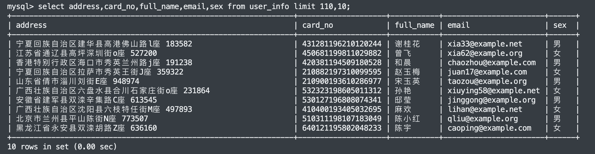

## 前言
目前手头上有个项目，要生成一些数据给客户看，如用户名、身份证号、邮箱、性别等等，但是实打实的用户数据录入也需要一段时间，时间不等人。偶然间看到 Python 里面有一个模块可以搞定我的问题，开始尝试。   


## 基础用法

此模块的 github 地址: [https://github.com/joke2k/faker](https://github.com/joke2k/faker)    

安装模块:  

```bash
pip install Faker
```

如果你的 pip 安装报错，建议网络搜索下错误，就此不做解释  

使用 `faker.Faker()` 创建和初始化一个 `faker` 生成器，它可以通过访问以您想要的数据类型命名的属性来生成数据。  

先来浅浅试一下：  

**main.py**  

```python
# 导入 Faker 模块
from faker import Faker

if __name__ == '__main__':
    # 创建 faker 创造器
    fake = Faker()
    # 指定地区，不然会生成英文名或国外地址等
    faker_cn = Faker(locale='zh_CN')
    print(faker_cn.name())
```
**输出:** 
```
李琳
```

> 测试输出一个地址  

```
print(faker_cn.address())
--输出--
上海市东莞县西夏大冶路c座 736941
```

| 方法                  | 作用             |
| --------------------- | ---------------- |
| address()             | 获取一个随机的地址 |
| administrative_unit() | 获取一个随机的省份 |
| city()                | 获取一个随机的市或县 |
| postcode() | 获取一个随机的邮政编码 |
| company() | 获取一个随机的公司名 |
| date() | 获取一个随机的日期 |
| ascii_free_email() | 获取一个随机的邮箱 |
| hostname() | 获取一个随机的网址 |
| ipv4() | 获取一个随机的 ip 地址 |

## 使用 Python 链接数据库并插入数据  

本文数据库使用的是`MySQL`，数据库名字为 `springboot`，建 `user_info` 表的语句如下：  

```sql
DROP TABLE IF EXISTS `user_info`;
CREATE TABLE `user_info` (
  `id` bigint NOT NULL AUTO_INCREMENT,
  `username` varchar(255) CHARACTER SET utf8mb4 COLLATE utf8mb4_general_ci DEFAULT NULL,
  `full_name` varchar(255) COLLATE utf8mb4_general_ci DEFAULT NULL,
  `address` varchar(255) COLLATE utf8mb4_general_ci DEFAULT NULL,
  `card_no` varchar(255) COLLATE utf8mb4_general_ci DEFAULT NULL,
  `email` varchar(255) COLLATE utf8mb4_general_ci DEFAULT NULL,
  `sex` varchar(255) COLLATE utf8mb4_general_ci DEFAULT NULL,
  `in_time` datetime(6) DEFAULT NULL,
  `is_member` bit(1) DEFAULT NULL,
  `password` varchar(255) COLLATE utf8mb4_general_ci DEFAULT NULL,
  `remark` varchar(255) COLLATE utf8mb4_general_ci DEFAULT NULL,
  PRIMARY KEY (`id`)
) ENGINE=InnoDB AUTO_INCREMENT=200 DEFAULT CHARSET=utf8mb4 COLLATE=utf8mb4_general_ci;
```

编写代码如下，注释都在其中:  

```python
from faker import Faker

'''
连接MySQL数据库
'''
import pymysql

if __name__ == '__main__':
    fake = Faker()
    # 指定生成特定地域的数据
    faker_cn = Faker(locale='zh_CN')
    # 创建数据库链接
    db = pymysql.connect(host="127.0.0.1", port=3306,
                         user='root',
                         passwd='root',
                         db='springboot',
                         charset='utf8')
    # 使用cursor()方法创建一个游标对象cursor
    cursor = db.cursor()
    # SQL 插入语句
    sql = """INSERT INTO user_info(username,address, card_no, full_name,
                email, sex,`password`,remark)
             VALUES (%s, %s, %s, %s, %s,%s,%s,%s)"""
    val = []
    for i in range(1, 100):
        # 生成测试用户名
        username = faker_cn.user_name()
        # 生成测试地址
        address = faker_cn.address()
        # 生成身份证号
        ssn = faker_cn.ssn()
        name = ""
        sex = ""
        if i % 2 == 0:
            name = faker_cn.name_female()
            sex = "女"
        else:
            name = faker_cn.name_male()
            sex = "男"
        # 生成测试邮箱
        email = faker_cn.safe_email()
        # 生成测试密码
        passwd = faker_cn.password()
        val.append((username, address, ssn, name, email, sex, passwd, ""))
    # 使用execute()方法执行SQL查询
    cursor.executemany(sql, val)
    # 提交到数据库执行
    db.commit()
    # 关闭数据库连接
    db.close()

```


## 查看测试数据

使用命令语句进入数据库：  

```bash
mysql -uroot -proot
```

`-u` 后跟的是用户名  

`-p` 后跟的是密码

进入数据库:  

```sql
mysql> use springboot;
mysql> select address,card_no,full_name,email,sex from user_info limit 110,10;
```

**输出：**  

